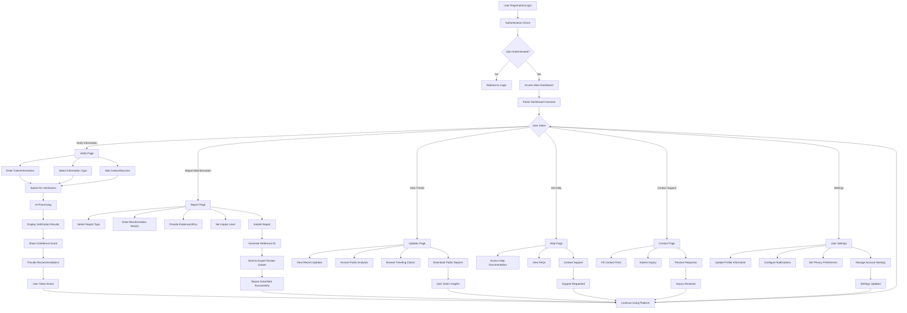
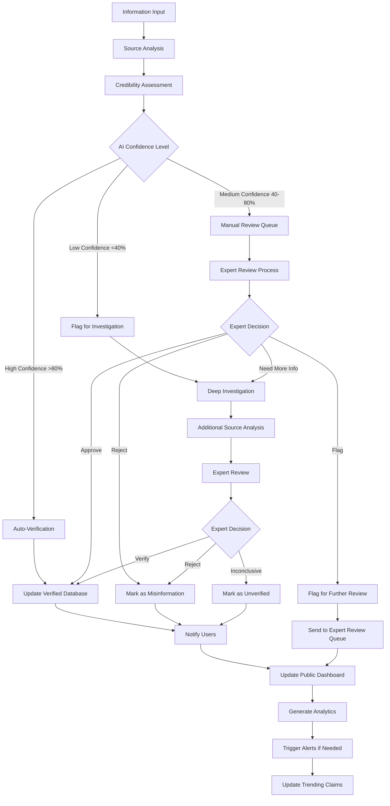
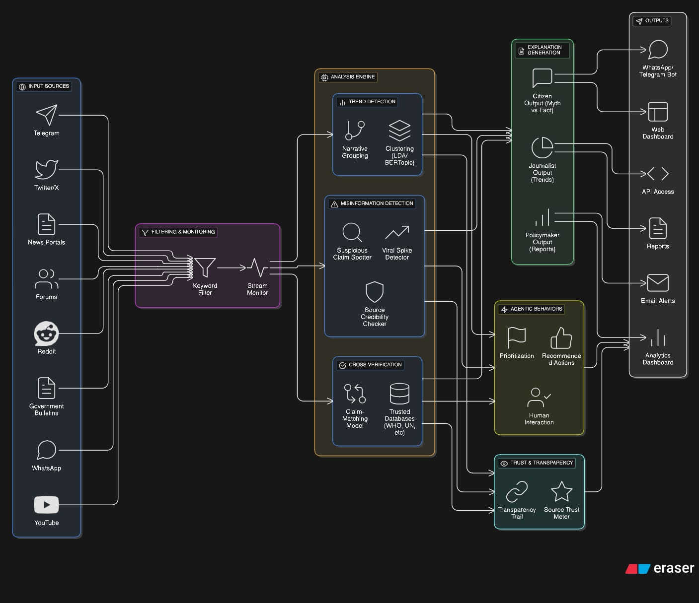

## Veritas

Lightweight, privacy‑aware truth discernment for information verification. Veritas aggregates signals from multiple sources, flags potential misinformation, and surfaces verified insights for journalists, researchers, and informed citizens.

### Description of the solution

Veritas is an agentic, truth‑seeking information lens - the eye that discerns the truth. It ingests multiple public data streams, applies credibility and provenance heuristics, highlights anomalies and potential misinformation, and presents users with concise, contextual truth assessments. The system centers on:
- Source monitoring and normalization
- Misinformation detection signals with transparent confidence cues
- Rapid verification workflows and provenance trails
- Trends, patterns, and credibility summaries
- Calibrated insights to minimize information noise

For the hackathon build, we focus on an end‑to‑end slice: live feed ingestion (mocked where needed), signal extraction, verification UI, and a dashboard that turns noisy information into verified truth.

### User Base

#### General Users
- **Informed Citizens**: Individuals seeking to verify news, social media claims, and public statements before sharing or acting on information
- **Students and Educators**: Students conducting research, educators teaching media literacy, and academic institutions promoting critical thinking
- **Small Business Owners**: Entrepreneurs and business professionals who need to verify market information, competitor claims, and industry news
- **Social Media Users**: Active social media participants who want to verify viral content before engaging or sharing

### User Process Flows

#### General User Process Flow

#### Information Verification Workflow

#### System Architecture & Data Flow

### The Problem it solves

- **Information overload in the digital age**: Streams of posts, reports, and claims are fragmented, noisy, and contradictory; truth‑seekers struggle to discern what's actually factual.
- **Early misinformation detection**: False narratives spread rapidly; we provide signals and verification cues to identify truth from fiction.
- **Actionable truth assessment, not just data**: Summaries, credibility scores, and source verification help users move from raw information to verified facts.
- **Information verification visibility**: Centralized dashboards for fact‑checking, source analysis, and truth assessment reduce research time and verification complexity.
- **Privacy and transparency by design**: Minimizes collection, emphasizes transparency and control over verification processes.

### Challenges we ran into

- **Data quality and heterogeneity**: Inconsistent formats, sparse metadata, and variable reliability across information sources.
- **Real‑time performance at scale**: Balancing low latency with robust verification processing, especially during information spikes.
- **Truth assessment signals**: Designing heuristics and UI cues that help users discern truth without over‑promising absolute certainty.
- **Information fatigue**: Calibrating relevance and grouping claims to avoid noisy, duplicative assessments.
- **Source credibility UX**: Conveying reliability and provenance simply, without adding cognitive load.
- **Privacy and compliance**: Handling user data and public content responsibly across jurisdictions.
- **Evolving narratives**: Continuously adapting taxonomy, filters, and dashboards to emerging truth verification challenges.

### Relevant track(s)

Misinformation: Create an Agentic AI system that continuously scans multiple sources of information, detects emerging misinformation, verifies facts, and provides easy‑to‑understand, contextual updates to help users discern truth from fiction.

How our project fits this track:
- We continuously monitor diverse feeds and normalize content for truth analysis.
- We run misinformation detection heuristics and credibility assessment with transparent confidence levels.
- We provide verification workflows and provenance trails to validate information claims.
- We deliver concise, contextual truth assessments and credibility insights suitable for researchers, journalists, and informed citizens.

### Technologies used

- Next.js (App Router) and React
- TypeScript
- Tailwind CSS and `shadcn/ui` component primitives
- FastAPI (Python) for APIs and agentic verification services
- Supabase (Postgres, Auth, Storage, Realtime)
- Charting utilities for trends and analytics
- Lightweight state and hooks for realtime UI
- Node.js toolchain for frontend build/runtime; backend served via FastAPI
