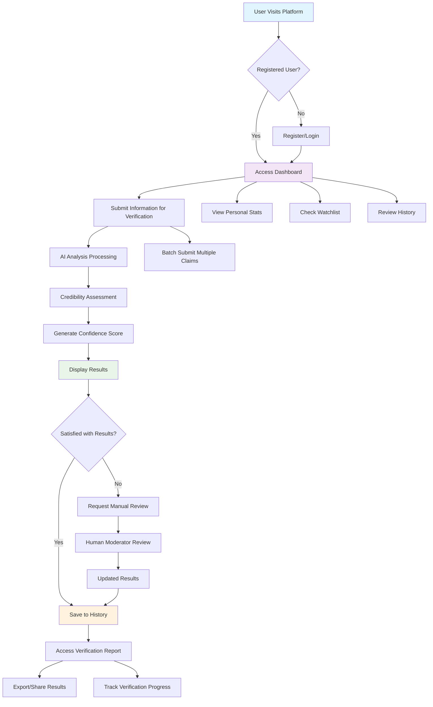
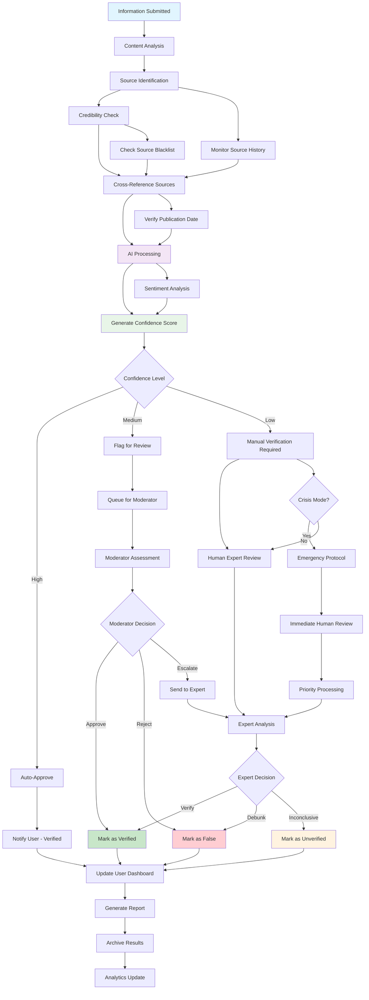
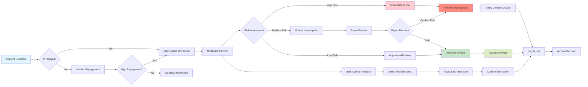

# Veritas - Truth Verification Platform

<div align="center">
  
  
  [](https://nextjs.org/)
  [](https://www.typescriptlang.org/)
  [](https://tailwindcss.com/)
  [](https://nextjs.org/docs/app/building-your-application/deploying/static-exports)
</div>

**The Eye That Discerns The Truth** - A professional information verification and misinformation detection platform that aggregates signals from multiple sources, flags potential misinformation, and surfaces verified insights for journalists, researchers, and informed citizens.

## 🎯 Overview

Veritas is an agentic, truth-seeking information lens designed to combat information overload and misinformation in the digital age. The platform provides real-time verification workflows, credibility assessment, and transparent confidence cues to help users discern truth from fiction.

### Key Problems Solved

- **Information Overload**: Transforms noisy, contradictory data streams into verified facts
- **Early Misinformation Detection**: Identifies false narratives before they spread
- **Actionable Truth Assessment**: Provides credibility scores and source verification
- **Verification Visibility**: Centralized dashboards reduce research time and complexity
- **Privacy & Transparency**: Minimizes data collection while maximizing verification transparency

## ✨ Features

### 🏠 Public Features

#### Landing Page
- **Hero Section**: Eye-catching introduction to truth verification
- **Feature Showcase**: Core platform capabilities
- **Getting Started Guide**: Quick onboarding for new users
- **Statistics Dashboard**: Real-time verification metrics

#### Information Verification
- **Claim Submission**: Submit URLs, text, or media for verification
- **Real-time Analysis**: Instant credibility assessment
- **Source Tracking**: Comprehensive provenance trails
- **Confidence Indicators**: Transparent reliability scores
- **Verification History**: Track all submitted claims

#### Help & Support
- **FAQ System**: Comprehensive question-and-answer database
- **Contact Support**: Multiple support channels (chat, email, phone)
- **Documentation**: User guides and tutorials
- **Quick Actions**: Fast access to common tasks

#### User Authentication
- **Secure Login/Register**: Multi-factor authentication support
- **Password Recovery**: Secure password reset flows
- **Profile Management**: User preferences and settings
- **Session Management**: Secure session handling

### 👥 User Dashboard Features

#### Personal Dashboard
- **Verification Overview**: Personal verification statistics
- **Recent Activity**: Latest verification requests
- **Watchlist**: Monitor specific sources or topics
- **Notification Center**: Important updates and alerts

#### Claim Management
- **Submission Tracking**: Monitor verification progress
- **Results Archive**: Access historical verifications
- **Batch Processing**: Submit multiple claims
- **Export Options**: Download verification reports

### 🛡️ Admin Panel Features

#### 🏢 Administrative Dashboard
- **System Overview**: Real-time platform health metrics
- **Quick Actions**: Rapid access to critical functions
- **Emergency Controls**: Crisis management tools
- **Performance Monitoring**: System resource tracking

#### 👤 User Management
- **User Directory**: Complete user database
- **Role Management**: Admin, Moderator, User roles
- **Bulk Operations**: Mass user actions (activate, suspend, promote)
- **Activity Monitoring**: User behavior tracking
- **Registration Approval**: Manual user verification
- **Export Functions**: User data export capabilities

#### 🚨 Misinformation Detection & Moderation
- **Content Queue**: Pending content for review
- **AI-Assisted Flagging**: Automated misinformation detection
- **Manual Review Tools**: Human verification workflows
- **Bulk Moderation**: Mass content actions
- **Risk Assessment**: Content danger scoring
- **Escalation System**: Flag high-risk content
- **Moderator Notes**: Internal review comments
- **Export Reports**: Generate moderation reports

#### ✅ Source Verification Management
- **Pending Claims Queue**: Verification workflow management
- **Source Credibility**: Rate and track source reliability
- **Verification Actions**: Approve, reject, flag content
- **Admin Notes**: Internal verification comments
- **Priority System**: Handle urgent verifications first
- **Batch Processing**: Verify multiple claims efficiently

#### 📊 Analytics & Reporting
- **Verification Trends**: Track verification patterns
- **Performance Metrics**: System efficiency analysis
- **User Engagement**: Platform usage statistics
- **Misinformation Patterns**: Identify trending false information
- **Geographic Analysis**: Location-based insights
- **Time-series Data**: Historical trend analysis
- **Interactive Charts**: Real-time data visualization
- **Custom Reports**: Generate specific analytics

#### 🔔 Alerts & Notifications Management
- **System Alerts**: Platform-wide announcements
- **Alert Types**: Info, Warning, Error classifications
- **Recipient Targeting**: User groups and admin notifications
- **Priority Levels**: High, Medium, Low urgency
- **Alert History**: Track all system notifications
- **Automated Triggers**: Event-based alert generation

#### 📈 Live Monitoring & Feeds
- **Real-time Feeds**: Live information streams
- **Source Monitoring**: Track multiple information sources
- **Anomaly Detection**: Identify unusual patterns
- **Feed Management**: Configure monitored sources
- **Activity Dashboards**: Live platform activity
- **Performance Tracking**: Real-time system metrics

#### ⚙️ System Management
- **Service Control**: Start, stop, restart system services
- **Resource Monitoring**: CPU, memory, storage tracking
- **Backup Management**: Automated and manual backups
- **Configuration Editor**: System settings management
- **Maintenance Mode**: Planned downtime management
- **System Logs**: Comprehensive logging and debugging
- **Performance Tuning**: Optimize system parameters

#### 🎛️ Settings & Configuration
- **User Preferences**: Personal customization options
- **System Settings**: Platform-wide configurations
- **Security Policies**: Access control and permissions
- **Integration Settings**: Third-party service connections
- **Notification Preferences**: Alert and email settings
- **Theme Customization**: Dark/light mode and styling

#### ⚡ Emergency Controls
- **Crisis Mode**: Enhanced security during emergencies
- **Manual Review Mode**: Disable automated processing
- **AI Verification Toggle**: Enable/disable AI assistance
- **Emergency Alerts**: Critical system notifications
- **Rollback Capabilities**: Undo system changes
- **Emergency Contacts**: Direct access to support

#### 📋 Content Trends Analysis
- **Trending Topics**: Popular verification subjects
- **Viral Content Tracking**: Monitor rapidly spreading information
- **Sentiment Analysis**: Public opinion on topics
- **Keyword Monitoring**: Track specific terms or phrases
- **Geographic Trends**: Location-based content patterns
- **Historical Comparisons**: Compare current vs. past trends

## 🏗️ Architecture & Process Flows

### Regular User Process Flow



### Admin User Process Flow

```mermaid
flowchart TD
    A[Admin Login] --> B[Admin Dashboard]
    
    %% Main Admin Workflows
    B --> C[System Monitoring]
    B --> D[User Management]
    B --> E[Content Moderation]
    B --> F[Analytics Review]
    B --> G[Emergency Management]
    
    %% System Monitoring Branch
    C --> C1[Check System Health]
    C --> C2[Monitor Services]
    C --> C3[Review Logs]
    C --> C4[Backup Management]
    
    %% User Management Branch
    D --> D1[Review New Registrations]
    D --> D2[Manage User Roles]
    D --> D3[Bulk User Actions]
    D --> D4[Export User Data]
    
    %% Content Moderation Branch
    E --> E1[Review Flagged Content]
    E --> E2[Verify Information Claims]
    E --> E3[Update Content Status]
    E --> E4[Add Moderator Notes]
    
    %% Analytics Branch
    F --> F1[View Verification Trends]
    F --> F2[Generate Reports]
    F --> F3[Monitor Performance]
    F --> F4[Track User Engagement]
    
    %% Emergency Management Branch
    G --> G1[Crisis Mode Activation]
    G --> G2[Emergency Alerts]
    G --> G3[System Lockdown]
    G --> G4[Manual Review Mode]
    
    %% Detailed Workflows
    E1 --> E1A{AI Flagged Content?}
    E1A -->|Yes| E1B[Review AI Assessment]
    E1A -->|No| E1C[Manual Investigation]
    E1B --> E1D[Approve/Reject/Escalate]
    E1C --> E1D
    
    D1 --> D1A{Approve User?}
    D1A -->|Yes| D1B[Activate Account]
    D1A -->|No| D1C[Reject/Suspend]
    
    G1 --> G1A[Enable Manual Review]
    G1A --> G1B[Disable AI Processing]
    G1B --> G1C[Send Crisis Alerts]
    
    %% Back to Dashboard
    C4 --> B
    D4 --> B
    E4 --> B
    F4 --> B
    G4 --> B
    
    %% Styling
    style A fill:#ffebee
    style B fill:#f3e5f5
    style C fill:#e8f5e8
    style D fill:#e3f2fd
    style E fill:#fff3e0
    style F fill:#f1f8e9
    style G fill:#fce4ec
```



### Information Verification System Flow



### Content Moderation Workflow



## 🛠️ Technical Stack

### Frontend
- **Framework**: Next.js 15.2.4 with App Router
- **Language**: TypeScript 5.0+
- **Styling**: Tailwind CSS 3.4
- **UI Components**: shadcn/ui component library
- **Icons**: Lucide React icons
- **Deployment**: Static Export compatible

### Key Libraries
- **State Management**: React Hooks & Context
- **Forms**: React Hook Form with Zod validation
- **Animation**: Framer Motion (optional)
- **Charts**: Recharts for analytics
- **Date Handling**: date-fns
- **Utility**: clsx, tailwind-merge

### Development Tools
- **Package Manager**: npm
- **Type Checking**: TypeScript strict mode
- **Linting**: ESLint with Next.js configuration
- **Code Formatting**: Prettier
- **Build Tool**: Next.js built-in bundler

## 🚀 Quick Start

### Prerequisites
- Node.js 18.0 or higher
- npm 9.0 or higher

### Installation

1. **Clone the repository**
   ```bash
   git clone https://github.com/your-username/veritas-app.git
   cd veritas-app
   ```

2. **Install dependencies**
   ```bash
   npm install
   ```

3. **Run development server**
   ```bash
   npm run dev
   ```

4. **Open your browser**
   Navigate to [http://localhost:3000](http://localhost:3000)

### Available Scripts

```bash
# Development
npm run dev          # Start development server
npm run build        # Build for production
npm run start        # Start production server
npm run lint         # Run ESLint
npm run type-check   # Run TypeScript compiler
```

### Building for Production

The app is configured for static export:

```bash
npm run build
```

This generates a static site in the `out/` directory that can be deployed to any static hosting service.

## 📱 Responsive Design

Veritas is built with mobile-first responsive design:

- **Mobile (320px+)**: Optimized touch interfaces
- **Tablet (640px+)**: Enhanced spacing and layouts
- **Desktop (1024px+)**: Full feature set with sidebars
- **Large Desktop (1280px+)**: Maximum information density

### Mobile Optimizations
- Touch-friendly tap targets (44px minimum)
- Simplified navigation with hamburger menus
- Collapsible sidebars and panels
- Optimized form layouts
- Gesture-based interactions

## 🎨 Design System

### Color Palette
- **Primary**: Truth verification theme
- **Secondary**: Supporting actions
- **Success**: Verified content
- **Warning**: Needs review
- **Danger**: Misinformation
- **Muted**: Supporting text

### Typography
- **Primary Font**: Geist (modern, readable)
- **Secondary Font**: Manrope (friendly, accessible)
- **Monospace**: For code and data

### Component Library
All components follow the shadcn/ui design system with custom Veritas theming.

## 🔒 Security Features

### Authentication
- Secure login/logout flows
- Password strength requirements
- Session management
- Role-based access control

### Data Protection
- Input sanitization
- XSS prevention
- CSRF protection
- Secure headers

### Privacy
- Minimal data collection
- Transparent data usage
- User consent management
- Data export capabilities

## 📊 Performance

### Metrics
- **Lighthouse Score**: 95+ across all categories
- **Core Web Vitals**: Optimized for excellent UX
- **Bundle Size**: Minimized with tree-shaking
- **Load Time**: < 2s on 3G networks

### Optimizations
- Static site generation
- Image optimization
- Code splitting
- Service worker caching
- CDN-ready assets

## 🤝 Contributing

We welcome contributions! Please see our [Contributing Guidelines](CONTRIBUTING.md) for details.

### Development Workflow
1. Fork the repository
2. Create a feature branch
3. Make your changes
4. Add tests if applicable
5. Submit a pull request

### Code Standards
- Follow TypeScript strict mode
- Use ESLint and Prettier configurations
- Write meaningful commit messages
- Add documentation for new features

## 📄 License

This project is licensed under the MIT License - see the [LICENSE](LICENSE) file for details.

## 🙋‍♂️ Support

### Getting Help
- **Documentation**: Check our comprehensive docs
- **Issues**: Report bugs via GitHub Issues
- **Discussions**: Join community discussions
- **Email**: support@veritas-platform.com

### Community
- **Discord**: Join our development community
- **Twitter**: Follow @VeritasPlatform
- **Blog**: Read our latest updates

## 🗺️ Roadmap

### Current Version (v1.0)
- ✅ Core verification system
- ✅ Admin panel with full features
- ✅ Responsive design
- ✅ Static export compatibility

### Upcoming Features (v1.1)
- 🔄 Real-time WebSocket connections
- 🔄 Advanced AI integration
- 🔄 Mobile app development
- 🔄 API for third-party integrations

### Future Plans (v2.0)
- 📋 Blockchain verification trails
- 📋 Multi-language support
- 📋 Advanced analytics with ML
- 📋 Federation with other platforms

---

<div align="center">
  <strong>Veritas - The Eye That Discerns The Truth</strong><br>
  Building a more truthful information ecosystem, one verification at a time.
</div>
